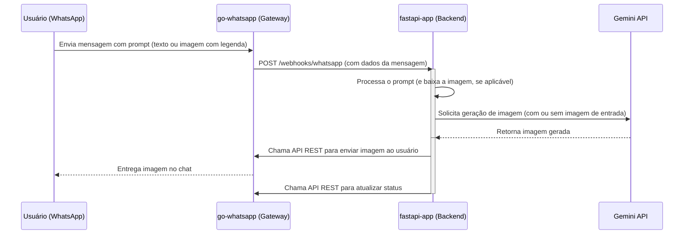

# Arquitetura do Klique WhatsApp Bot

## Visão Geral

A arquitetura do Klique WhatsApp Bot é baseada em microsserviços containerizados e orquestrados pelo Docker Compose. O sistema é composto por um gateway de WhatsApp (`go-whatsapp`), uma API de backend (`fastapi-app`) que atua como orquestradora, e o banco de dados `mongodb`.

## Estrutura de Diretórios (API)

A estrutura atual da `fastapi-app` implementada com a lógica de webhook:

```
klique-api/
├── app/
│   ├── routers/
│   │   ├── whatsapp.py        # Endpoint para receber webhooks do go-whatsapp
│   │   ├── auth.py           # Autenticação e autorização
│   │   ├── register.py       # Registro de usuários
│   │   └── schemas.py        # Esquemas Pydantic
│   ├── services/
│   │   ├── gemini.py         # Lógica para interagir com a API do Gemini
│   │   ├── whatsapp.py       # Cliente para a API REST do go-whatsapp
│   │   └── shared.py         # Serviços compartilhados e lifespan
│   ├── cache.py              # Sistema de cache MongoDB
│   ├── config.py             # Configurações da aplicação
│   ├── database.py           # Conexões MongoDB
│   ├── dependencies.py       # Dependências para autenticação
│   ├── logger.py             # Sistema de logging
│   ├── main.py               # Aplicação FastAPI principal
│   ├── utils.py              # Utilitários compartilhados
│   └── webhook_dependencies.py # Dependências específicas para webhooks
├── tests/
│   ├── test_cache.py         # Testes do sistema de cache
│   ├── test_gemini.py        # Testes da integração com Gemini
│   └── ...
├── logs/                     # Logs da aplicação
├── docker-compose.yml        # Orquestração dos serviços
├── Dockerfile               # Build da aplicação
├── pyproject.toml           # Configuração do projeto e dependências
└── uv.lock                  # Lock file das dependências
```

## Componentes Principais

*   **`go-whatsapp` (Gateway)**:
    *   Serviço baseado na imagem `ghcr.io/aldinokemal/go-whatsapp-web-multidevice`.
    *   Responsável por se conectar à rede do WhatsApp.
    *   Expõe uma API REST na porta `3000` para envio de mensagens e atualização de status.
    *   Envia um webhook para a `fastapi-app` a cada nova mensagem recebida.

*   **`fastapi-app` (Backend/Orquestrador)**:
    *   Recebe os webhooks do `go-whatsapp` em um endpoint dedicado (ex: `/webhooks/whatsapp`).
    *   Processa o prompt da mensagem recebida (texto e/ou imagem).
    *   Faz o download da imagem de entrada, se houver, através do `WhatsAppService`.
    *   Chama o `GeminiService` para gerar a imagem.
    *   Utiliza um cliente HTTP interno (`WhatsAppService`) para fazer chamadas à API REST do `go-whatsapp`, enviando a imagem gerada e atualizando o status.

*   **`mongodb` (Banco de Dados)**:
    *   Armazena logs, informações de usuários e prompts.

## Fluxo de Requisição (Geração de Imagem via WhatsApp)

O diagrama abaixo ilustra o fluxo completo.

