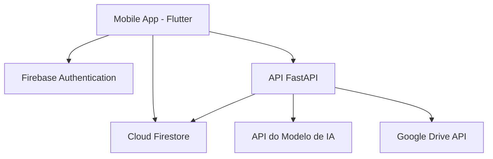

# Documento de Design de Sistema: Aplicativo Klique (MVP)

## 1. Visão Geral do Sistema

Este documento descreve o Mínimo Produto Viável (MVP) do aplicativo Klique. A proposta de valor central do aplicativo é permitir que qualquer usuário edite suas imagens em minutos, apenas com texto simples e/ou voz. O sistema utilizará uma arquitetura híbrida, combinando o poder do Firebase para autenticação e dados de usuário, com uma API de backend customizada para processamento de imagens e lógica de negócios.

Este MVP também inclui funcionalidades sociais e de engajamento: os usuários podem compartilhar seus prompts de edição, e o aplicativo oferece uma experiência de "descoberta" na abertura, mostrando possíveis versões do usuário em diferentes universos através da IA.

## 2. Arquitetura de Alto Nível (MVP)

A arquitetura do MVP adota um modelo híbrido:

*   **Front-end (Mobile App):** O aplicativo móvel para iOS/Android, construído em Flutter.
*   **Firebase Services:**
    *   **Firebase Authentication:** Para o gerenciamento de contas de usuário.
    *   **Cloud Firestore:** Para armazenar metadados de usuários e informações da aplicação.
*   **Backend (API FastAPI):** Uma API customizada construída com FastAPI (Python) que orquestra a lógica principal.
    *   **Geração de Imagem:** Interage com a API do modelo de IA.
    *   **Gerenciamento de Arquivos:** Salva as imagens originais e editadas no Google Drive do usuário.
    *   **Gerenciamento de Prompts:** Salva e recupera os prompts dos usuários.

## 3. Detalhamento dos Componentes

### 3.1. Front-end (Aplicativo Móvel)

*   **Tecnologia:** Flutter.
*   **Telas do MVP:**
    *   **Edição de Foto:** A tela principal do MVP, onde o usuário faz o upload da foto e insere o prompt de edição.
    *   **Login/Cadastro:** Telas básicas para autenticação de usuário via Firebase Auth.
    *   **Tela de Descoberta:** Uma nova tela ou modal exibido na abertura do aplicativo que tira uma foto do usuário (com permissão) e mostra versões geradas pela IA.
    *   **Galeria de Prompts:** Uma tela onde os usuários podem ver e reutilizar seus prompts salvos.
*   **Funcionalidades:** Gerenciamento de estado, chamadas para a API FastAPI e atualização da UI com dados do Firestore.

### 3.2. Back-end

*   **Firebase Services:**
    *   **Firebase Authentication:** Gerencia o registro, login e sessões de usuários. O token de ID do Firebase será usado para autenticar as requisições na API FastAPI.
    *   **Cloud Firestore:** Armazena os dados do usuário e metadados da aplicação.
        *   `users`: { userId, email, settings (e.g., enableMultiverse), lastFreeImagesReset, imageCount30Min, subscriptionPlan }
        *   `prompts`: { promptId, userId, promptText, timestamp }
*   **API FastAPI (Python):**
    *   **Lógica da API:**
        *   Recebe a imagem, o prompt de texto e o token de autenticação do Firebase do usuário.
        *   Valida o token do Firebase para autenticar o usuário.
        *   Verifica os limites de uso do usuário (dados do Firestore).
        *   Chama a API do modelo de IA para gerar a imagem editada.
        *   Usa a API do Google Drive para salvar a imagem original e a editada na pasta do usuário.
        *   Salva o prompt do usuário no Cloud Firestore, se solicitado.
        *   Retorna a URL da imagem editada (ou a própria imagem) para o aplicativo cliente.

## 4. Fluxo de Dados: Edição de Foto

1.  O usuário seleciona uma foto e insere um prompt no aplicativo.
2.  O aplicativo envia a foto, o prompt e o token de autenticação do Firebase para a API FastAPI.
3.  A API FastAPI valida o usuário, verifica os limites de uso e orquestra o processo:
    a.  Envia a imagem e o prompt para a API de IA.
    b.  Recebe a imagem editada.
    c.  Salva a imagem editada no Google Drive do usuário.
    d.  Salva o prompt no Firestore.
4.  A API FastAPI retorna o resultado para o aplicativo, que exibe a imagem editada para o usuário.

## 5. Escalabilidade e Considerações de Segurança

*   **Escalabilidade:** A API FastAPI será hospedada em uma plataforma de nuvem (ex: Google Cloud Run, Vercel, etc.) que permite auto-scaling. O Firebase gerencia a escalabilidade para autenticação e banco de dados.
*   **Segurança:** A API FastAPI será protegida, exigindo um token de ID do Firebase válido para todas as requisições. As regras de segurança do Firestore garantirão que os usuários só possam acessar seus próprios dados. As credenciais do Google Drive serão gerenciadas de forma segura no ambiente da API.

## 6. Próximos Passos (MVP)

*   Desenvolver e hospedar a API FastAPI.
*   Definir as regras de segurança do Firebase e da API.
*   Desenvolver as telas do Flutter e a lógica de comunicação com a API.
*   Integrar a funcionalidade de compartilhamento nativo do Flutter.

## 7. Estrutura de Monetização

O aplicativo Klique adota um modelo Freemium, gerenciado pela API FastAPI.

*   **Nível Gratuito:** Limite de 5 imagens a cada 30 minutos.
*   **Planos Pagos (Assinatura):** Acesso ilimitado à geração de imagens.
*   **Tecnologia de Pagamento:** Google Play Billing e Apple App Store In-App Purchases.