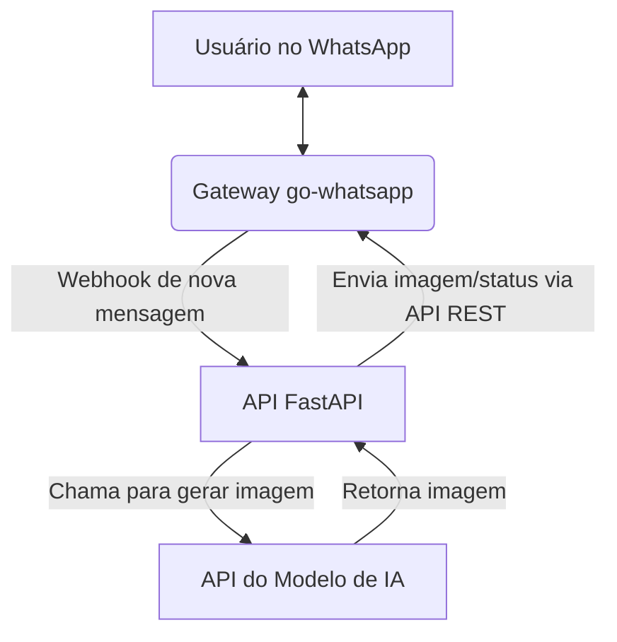

# Documento de Design de Sistema: Klique WhatsApp Bot

## 1. Visão Geral do Sistema

Este documento descreve a arquitetura do Klique, um serviço que permite aos usuários gerar imagens através de conversas no WhatsApp e publicá-las automaticamente como status. A proposta de valor é oferecer uma maneira rápida e interativa de criar e compartilhar conteúdo visual sem sair do WhatsApp.

O sistema é composto por três componentes principais: um gateway de WhatsApp, uma API de backend para orquestração e a API de um modelo de IA para geração de imagens.

## 2. Arquitetura de Alto Nível

A arquitetura é baseada em microsserviços containerizados, orquestrados pelo Docker Compose.

*   **Gateway WhatsApp (`go-whatsapp`):** Um serviço em Go que expõe uma API REST para interagir com a rede do WhatsApp. Ele é responsável por receber mensagens dos usuários e enviar imagens ou textos de volta, além de gerenciar a atualização de status.
*   **Backend (`fastapi-app`):** O cérebro da operação. Uma API em Python (FastAPI) que recebe webhooks do gateway, processa os prompts, chama o modelo de IA e instrui o gateway sobre quais ações tomar (enviar mensagem, atualizar status).
*   **Banco de Dados (`mongodb`):** Armazena informações sobre usuários, prompts e logs.
*   **API do Modelo de IA (Gemini):** Serviço externo responsável pela geração das imagens.

## 3. Detalhamento dos Componentes

### 3.1. Gateway WhatsApp (`go-whatsapp`)

*   **Tecnologia:** `ghcr.io/aldinokemal/go-whatsapp-web-multidevice` (Imagem Docker).
*   **Funcionalidades:**
    *   Conecta-se a uma conta do WhatsApp via QR Code.
    *   Expõe uma API REST na porta `3000` para controle programático.
    *   Envia webhooks para um endpoint configurado (`fastapi-app`) quando novas mensagens são recebidas.
    *   Permite o envio de mensagens (texto e imagem) e a atualização de status através de chamadas à sua API REST.

### 3.2. Backend (`fastapi-app`)

*   **Tecnologia:** Python com FastAPI.
*   **Lógica da API:**
    *   **Endpoint de Webhook:** Recebe notificações de novas mensagens do `go-whatsapp`.
    *   **Processamento de Prompt:** Extrai o texto da mensagem do usuário para ser usado como prompt.
    *   **Orquestração:** Chama a `Gemini API` para gerar a imagem.
    *   **Cliente WhatsApp:** Possui um cliente HTTP para fazer requisições à API REST do `go-whatsapp`, enviando a imagem gerada para o usuário e atualizando o status.
    *   **Gerenciamento de Estado:** Utiliza o `mongodb` para registrar interações e controlar o fluxo.

## 4. Fluxo de Dados: Geração de Imagem via WhatsApp

1.  O usuário envia uma mensagem de texto (prompt) para o número de WhatsApp conectado.
2.  O serviço `go-whatsapp` recebe a mensagem e dispara um webhook para a `fastapi-app`.
3.  A `fastapi-app` recebe o webhook, extrai o prompt e o ID do usuário (remetente).
4.  A API chama o serviço do Gemini para gerar a imagem com base no prompt.
5.  Após receber a imagem gerada, a API faz duas chamadas para a API REST do `go-whatsapp`:
    a.  Uma para enviar a imagem diretamente para o chat do usuário.
    b.  Outra para publicar a imagem como um novo status do WhatsApp.
6.  O usuário recebe a imagem no chat e pode ver a mesma imagem no status do bot.

## 5. Escalabilidade e Considerações de Segurança

*   **Escalabilidade:** A arquitetura em contêineres permite escalar os serviços individualmente. O `fastapi-app` pode ser replicado para lidar com um volume maior de webhooks.
*   **Segurança:** A comunicação entre os serviços (`fastapi-app` e `go-whatsapp`) ocorre na rede interna do Docker. A API do `go-whatsapp` é protegida por autenticação básica. O endpoint de webhook na `fastapi-app` deve ser protegido para aceitar requisições apenas do gateway.

## 6. Próximos Passos (MVP)

*   Desenvolver o endpoint de webhook na `fastapi-app`.
*   Implementar o cliente para a API REST do `go-whatsapp`.
*   Integrar a lógica de geração de imagem (Gemini) ao novo fluxo.
*   Configurar os webhooks no serviço `go-whatsapp`.
*   Testar o fluxo de ponta a ponta.