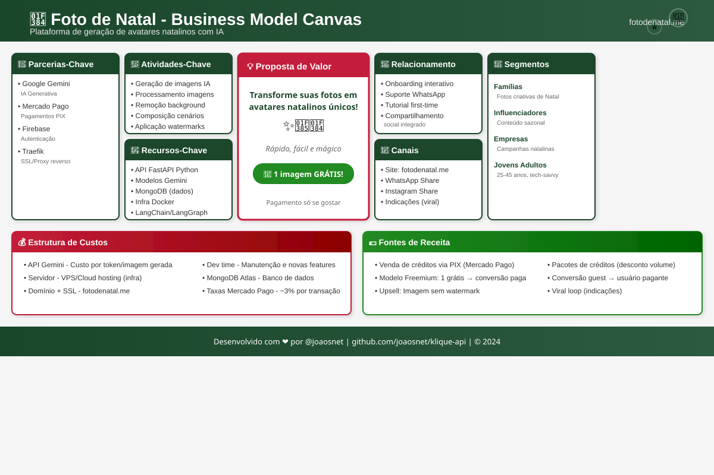

# 🎄 Klique API - Foto de Natal

> **Plataforma de geração de avatares natalinos com IA** - Transforme suas fotos em personagens mágicos de Natal usando inteligência artificial.

[](https://fastapi.tiangolo.com/)
[](https://python.org)
[](https://mongodb.com)
[](https://docker.com)

---

## 📊 Business Model Canvas

<p align="center">
  
</p>

<details>
<summary><strong>📋 Ver Canvas em Texto</strong></summary>

| 🤝 Parcerias-Chave | 🎯 Atividades-Chave | 💡 Proposta de Valor | 💝 Relacionamento | 👥 Segmentos de Clientes |
|:-------------------|:--------------------|:---------------------|:------------------|:------------------------|
| • **Google Gemini/Flux** - IA generativa | • Fine-tuning de modelos | **Realismo fotorealista superior & Personalização Hiperlocal** | • Chat IA em Português | • **Famílias** (Fotos criativas de Natal) |
| • **Mercado Pago** - Pagamentos PIX | • Geração de imagens & GIFs | **Mapa dos Sonhos 2026** (Vision Board IA) | • Suporte via WhatsApp | • **Público "Lei da Atração"** (Coaching/Metas) |
| • **Firebase** - Autenticação | • Remoção de background | ✨ *Interface 100% PT-BR e Prompts Locais* | • Tutorial first-time user | • **Influenciadores** & Empresas |
| • **Traefik** - SSL/Proxy | • Composição de cenários | | • Compartilhamento social | • **Jovens adultos** (25-45) tech-savvy |

| 💰 Estrutura de Custos | 💵 Fontes de Receita |
|:-----------------------|:---------------------|
| • API IA (Gemini/Flux) - Custo por geração | • Venda de créditos via PIX |
| • Servidor VPS/Cloud (GPU inference se self-hosted) | • **Mapa dos Sonhos**: R$ 9,90 por mapa HD |
| • Marketing (TikTok/LinkedIn) | • Upsell: Refinamento extra (R$ 2,00) |

</details>

---

## 🎯 Análise de Nicho

### Nicho Principal
**Entretenimento Visual Sazonal com IA** — Subcategoria de **AI Consumer Apps** focada em:
- Transformação de fotos pessoais
- Datas comemorativas (Natal, Páscoa, Halloween)
- Viralização social orgânica

### Classificação de Mercado

| Nível | Categoria |
|-------|-----------|
| **Macro** | AI-Powered Consumer Applications |
| **Médio** | Photo Transformation / Avatar Generation |
| **Micro** | Seasonal Entertainment (Holiday-themed AI) |

### Comparáveis de Mercado
- **Lensa AI** — Avatares mágicos (virou viral em 2022)
- **Dawn AI** — Transformação de fotos
- **Remini** — Melhorias de foto com IA
- **MyHeritage Deep Nostalgia** — Animação de fotos antigas

---

## 🚀 Diferenciação Competitiva

Para superar concorrentes como Canva, Fotor e Musely, focamos em **realismo fotorealista superior**, **personalizações hiperlocais** (nomes brasileiros, trajes regionais) e **integrações exclusivas**. Priorizamos **velocidade**, **acessibilidade móvel** e **monetização híbrida**; evitamos prompts genéricos — usamos **IA conversacional** para refinar resultados em tempo real.

| Concorrente | Fraqueza Principal | 🏆 Nosso Diferencial |
|:------------|:-------------------|:---------------------|
| **Canva** | Templates prontos, menos realismo em fotos humanas | **Geração 100% personalizada** com selfie + prompt (ex.: "Papai Noel com camisa do Paysandu"). Realismo extremo via fine-tuning (ex.: Flux Pro). |
| **Fotor/Musely** | Estilos limitados (anime/vintage), detecção fácil como IA | **50+ estilos hiper-realistas** (não detectáveis), vídeos curtos (5s GIFs natalinos) e **AR preview** no celular. |
| **YouCam/Leonardo** | Foco global, prompts em inglês | **Interface 100% PT-BR**, prompts locais ("foto natal Belém com mangueira"), **chat IA em português** para iterações ("torne mais quente, adicione família paraense"). |

### ⚡ Implementação Rápida (1-2 semanas)
- **Fine-tune**: Ajuste rápido de modelo com dataset brasileiro/natalino (ex.: Stable Diffusion, DALL·E ou Flux Pro) para realismo extremo.
- **IA Conversacional**: Chat interativo em Português para refinar resultados em tempo real — evita prompts genéricos e aumenta satisfação.
- **Monetização Híbrida**: B2C (freemium + upsell), B2B (API para agências/empresas) e **produtos físicos** (parcerias de impressão, brindes corporativos).
- **Upsell**: R$ 2,00 por refinamento extra; oferecer pacotes e opções empresariais.
- **Impacto estimado**: Aumenta retenção ~3x e conversão 20–30%.

---

## ✨ Gerador de Mapa dos Sonhos 2026 (Expansão)

Um "vision board" IA que gera colagens de imagens baseadas em objetivos (carreira, saúde, viagens), integrando a selfie do usuário em cenas futuras.

> **Por que adiciona valor?** Expande além do Natal, gerando renda o ano todo (pico em jan/fev).

### 🛠️ Como Funciona (MVP 7-10 dias)
1. **Input**: Usuário lista 5-10 sonhos + foto opcional.
2. **Geração**: Prompt dinâmico — ex.: "Colagem vision board: [sonho1] realista, [sonho2] motivacional, layout grid 3x3"; IA incorpora selfie do usuário nas cenas.
3. **Entrega**: Colagem automática exportável (PNG/PDF) + texto afirmativo personalizado.

**Stack MVP**: Backend FastAPI + modelos via Hugging Face (Flux.1 ou Playground v2.5) para imagens realistas; frontend: nova aba no site com input de texto e upload de foto.

### 💰 Modelo de Negócio
- **Freemium**: 3 imagens grátis para experimentar.
- **Premium**: **R$ 9,90** por Mapa HD + texto afirmativo personalizado.
- **Upsell**: Refinamentos adicionais (R$ 2 cada) e pacotes HD.
- **Promoção**: Lançar como **"Mapa dos Sonhos 2026"** no LinkedIn, TikTok e campanhas virais.

---

## 💡 Insights para Aumentar Lucratividade

### 1. 🔥 Aproveitar a Sazonalidade (CURTO PRAZO)

| Temporada | Tema | Meses |
|-----------|------|-------|
| 🎄 Natal | Papai Noel, Elfos, Renas | Nov-Dez |
| 🐰 Páscoa | Coelhinhos, Ovos | Mar-Abr |
| 🎃 Halloween | Vampiros, Bruxas | Out |
| 💘 Dia dos Namorados | Cupido, Corações | Jun |
| 🎉 Carnaval | Fantasias, Máscaras | Fev-Mar |

> **Insight**: Pivotar o site para cada temporada mantém receita o ano inteiro. Mesmo domínio, temas diferentes.

### 2. 💰 Otimização de Monetização

#### Atual (Bom)
- ✅ 1 imagem grátis → conversão
- ✅ Watermark no free tier
- ✅ PIX integrado

#### Melhorias Sugeridas

| Estratégia | Potencial | Esforço |
|------------|-----------|---------|
| **Pacotes família** (5 fotos por R$ X) | 🔥🔥🔥 Alto | Baixo |
| **Assinatura mensal** (ilimitado) | 🔥🔥 Médio | Médio |
| **Versão empresarial** (API para agências) | 🔥🔥🔥 Alto | Alto |
| **Impressão física** (parceria com gráficas) | 🔥🔥 Médio | Médio |
| **NFT/Colecionáveis digitais** | 🔥 Baixo | Alto |

### 3. 📈 Estratégias de Growth

#### Viral Loop (já implementado ✅)
```
Usuário cria foto → Compartilha WhatsApp/Instagram → Amigo vê → Cria foto → Repete
```

#### Melhorias Sugeridas

| Tática | Descrição | Impacto |
|--------|-----------|---------|
| **Referral Program** | "Indique 3 amigos, ganhe 1 crédito" | 🔥🔥🔥 |
| **Watermark com URL** | Logo + fotodenatal.me na imagem | 🔥🔥 |
| **Trending hashtags** | #FotoDeNatal #NatalIA | 🔥🔥 |
| **TikTok/Reels Ads** | Público 25-45, interesse família | 🔥🔥🔥 |
| **Parcerias com influencers** | Micro-influencers de família | 🔥🔥 |

### 4. 🎯 Segmentação de Preços

| Tier | Preço Sugerido | Inclui |
|------|----------------|--------|
| **Teste** | Grátis | 1 foto com watermark |
| **Básico** | R$ 4,90 | 1 foto HD sem watermark |
| **Família** | R$ 14,90 | 5 fotos HD |
| **Premium** | R$ 29,90 | 15 fotos + cenários exclusivos |
| **Ilimitado** | R$ 49,90/mês | Geração ilimitada |

### 5. 🚀 Próximos Passos Recomendados

1. **AGORA (Natal 2024)**: Maximizar conversão com urgência ("Faltam X dias pro Natal!")
2. **Janeiro**: Adicionar tema Carnaval 🎭
3. **Fevereiro**: Implementar referral program
4. **Março**: Lançar tema Páscoa 🐰
5. **Q2 2025**: Considerar app mobile (React Native)

---

## 📊 Métricas-Chave (KPIs)

| Métrica | O que medir |
|---------|-------------|
| **CAC** | Custo de Aquisição de Cliente |
| **LTV** | Valor do tempo de vida do cliente |
| **Conversion Rate** | Free → Paid (target: 5-10%) |
| **Viral Coefficient** | Indicações por usuário (target: >1) |
| **ARPU** | Receita média por usuário |

---

## 🚀 Começando

### Pré-requisitos
- Python 3.14+ | Docker & Docker Compose | MongoDB
- Chaves de API (Gemini, Mercado Pago, Firebase)

### Instalação Local

```bash
git clone https://github.com/joaosnet/klique-api.git
cd klique-api
uv sync
cp .env.example .env
uv run task run
```

### Docker (Produção)

```bash
docker-compose -f docker-compose.production.yml up -d
```

---

## 📁 Estrutura do Projeto

```
klique-api/
├── app/
│   ├── agents/        # Agentes LangChain/LangGraph
│   ├── routers/       # Endpoints FastAPI
│   ├── services/      # Serviços de negócio
│   └── main.py        # Entrypoint
├── frontend/          # React SPA
├── docs/              # Documentação + SVG Canvas
└── tests/             # Testes automatizados
```

---

## 🔧 Tecnologias

| Camada | Stack |
|--------|-------|
| **Backend** | FastAPI, Python 3.14, LangChain, LangGraph |
| **IA** | Google Gemini, OpenCV, Pillow |
| **Database** | MongoDB |
| **Payments** | Mercado Pago (PIX) |
| **Infra** | Docker, Traefik, Let's Encrypt |
| **Frontend** | React, Vite |

---

## 📄 Licença

MIT License — Veja [LICENSE](./LICENSE)

---

<div align="center">

**Feito com ❤️ e ☕ por [@joaosnet](https://github.com/joaosnet)**

🎄 *Transformando memórias em magia natalina* 🎅

</div>
